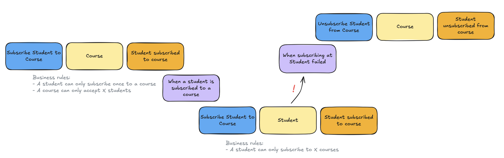
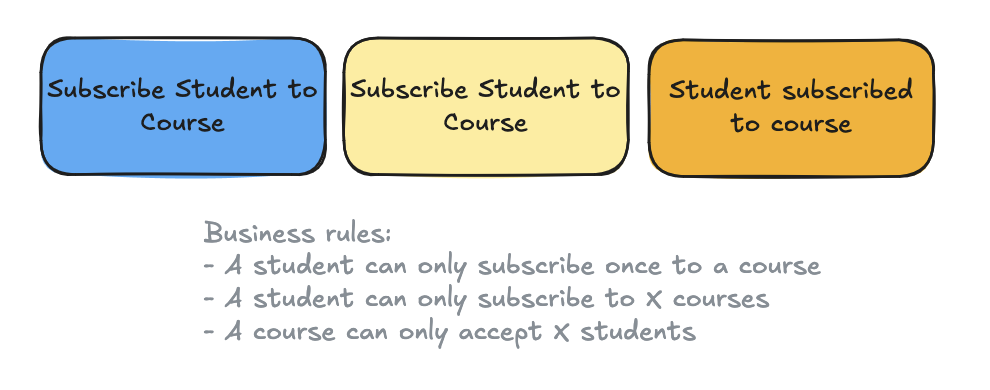

## Background

PHP has several excellent libraries for event sourcing: [Broadway](https://github.com/broadway), [EventSauce](https://github.com/EventSaucePHP), [Prooph](https://github.com/prooph), and [Ecotone](https://github.com/ecotoneframework). They all treat the "aggregate" as the primary building block of event sourcing, with a strict one-to-one relationship between domain events and aggregates.

In traditional event-sourced applications, aggregates have strict boundaries. This means domain events cannot be reused by multiple aggregates. A common rule in event sourcing is that all business logic for an aggregate must reside within that aggregate.

Because aggregates are internally consistent, any behavioral change locks the aggregate from other changes, even when those changes are unrelated from a domain perspective.

Evans described aggregates in his 'blue book' as:

> Cluster the ENTITIES and VALUE OBJECTS into AGGREGATES and define boundaries around each. Choose one ENTITY to be the root of each AGGREGATE, and control all access to the objects inside the boundary through the root. Allow external objects to hold reference to the root only.

_From "Domain-Driven Design: Tackling Complexity in the Heart of Software" by Eric Evans._

However, this approach often leads to "fat aggregates" over time.

Additionally, the aggregate is a technical concept that can be difficult to explain to non-technical stakeholders, such as during [EventStorming](https://github.com/ddd-crew/eventstorming-glossary-cheat-sheet) sessions.

## In a nutshell

### Traditional 'Aggregate driven' Event Sourcing

Domain concepts are modeled towards objects: the aggregate.

- Any business logic related to a single domain object should live inside the aggregate
- Logic that involves other domain objects or groups of the same kind of domain objects does not belong in the aggregate

### 'Use case driven' Event Sourcing

Domain concepts are modeled through use cases.

- Any business logic tied to a use case should live inside that use case
- A use case can relate to one or more domain concepts

## Gember Event Sourcing

Gember addresses these issues by taking a different approach, using the "Dynamic Consistency Boundary" (DCB) pattern.

## The Dynamic Consistency Boundary (DCB) pattern

Sara Pellegrini introduced the DCB pattern in 2023, rethinking the traditional approach to event sourcing. She explains it thoroughly in her talk: ["The Aggregate is dead. Long live the Aggregate!"](https://sara.event-thinking.io/2023/04/kill-aggregate-chapter-1-I-am-here-to-kill-the-aggregate.html) (highly recommended).

> **In a nutshell:** the DCB pattern removes the strict one-to-one relationship between aggregates and domain events.

This means domain events can be reused by multiple "use cases" (the aggregates). Use cases can be built from a subset of domain events, or even from events across different "domain tags" (the aggregate identifiers).

This aligns well with how EventStorming views aggregates today. What were once called aggregates are now often seen as "systems" or "consistent business rules", making the problem space easier to understand for non-technical stakeholders.

When domain events can be shared across multiple use cases, synchronization between aggregates is no longer necessary. Domain services, typically used to manage business logic across aggregates, are no longer needed. Sagas, when used for synchronizing the same behavior between aggregates (e.g. subscribe _student_ to _course_), are also no longer required.

Replacing fat aggregates with multiple use cases also resolves consistency issues (optimistic locking) between behavioral changes that are unrelated from a domain perspective. A use case is consistent only for the specific subset of domain events relevant to its domain tags and subscribed event types.

> For example, splitting into different use cases allows a course title to be changed without blocking a student from enrolling in that course (from Sara Pellegrini's example).

Overall, the DCB pattern reduces the accidental complexity introduced by aggregates, allowing us to build software that better reflects the real world.

**More information about the DCB pattern:**

- **Dynamic Consistency Boundary - Explanation, resources, specification**
   Website: [https://dcb.events](https://dcb.events)
- **"Kill the aggregate!"** - Sara Pellegrini, Milan Savic, 2023
   Blog: [https://sara.event-thinking.io/2023/04/kill-aggregate-chapter-1-I-am-here-to-kill-the-aggregate.html](https://sara.event-thinking.io/2023/04/kill-aggregate-chapter-1-I-am-here-to-kill-the-aggregate.html)
- **"AxonIQ Con 2023: Kill Aggregate! with Sara Pellegrini & Milan Savic"**
   Talk: [https://www.youtube.com/watch?v=wXt54BawI-8](https://www.youtube.com/watch?v=wXt54BawI-8)
- **"Kill Aggregate - Volume 2 - Sara Pellegrini at JOTB25"**
   Talk: [https://www.youtube.com/watch?v=AQ5fk4D3u9I](https://www.youtube.com/watch?v=AQ5fk4D3u9I)
- **"Rethinking microservices architecture through Dynamic Consistency Boundaries"** - Bruce Hopkins, 2024 
   Blog: [https://www.axoniq.io/blog/rethinking-microservices-architecture-through-dynamic-consistency-boundaries](https://www.axoniq.io/blog/rethinking-microservices-architecture-through-dynamic-consistency-boundaries)
