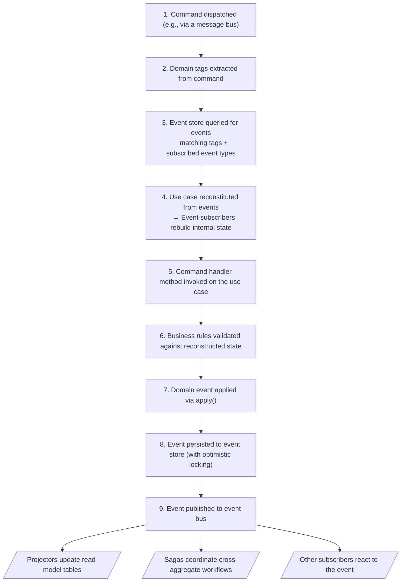
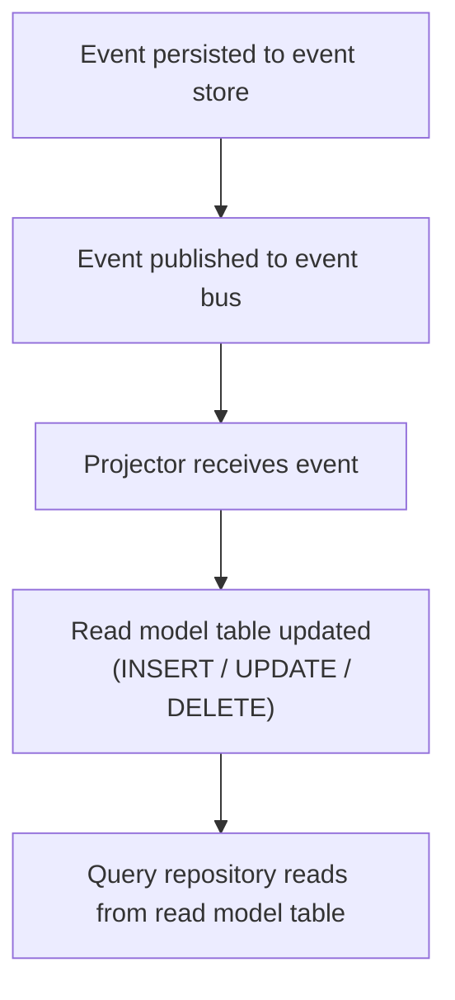

## How it works

This section explains how the core concepts of _Gember Event Sourcing_ fit together, from command dispatch to event persistence and read model updates.

### End-to-end flow

When a command is dispatched, the following process occurs:

### Event store

Events are persisted in two storage structures:

**Event store** - The primary event log:

| Field | Description |
|-------|-------------|
| `id` | Unique event ID |
| `event_name` | Event type (e.g., `course.created`) |
| `payload` | Serialized event data (typically JSON) |
| `metadata` | Additional context (e.g., user, correlation ID) |
| `applied_at` | Timestamp when the event was applied |

**Event store relations** - Links events to domain tags for efficient retrieval:

| Field | Description |
|-------|-------------|
| `event_id` | Reference to the event |
| `domain_tag` | A domain tag value from the event |

When an event is persisted, a relation row is created for each `#[DomainTag]` property on the event. This allows the event store to efficiently query events when loading a use case. The query is scoped by both the domain tags (from the command) and the subscribed event types (from the use case's `#[DomainEventSubscriber]` methods), so only relevant events are loaded.

### Domain tags across components

Domain tags appear on commands, use cases, and events, each serving a different purpose:

| Component | Domain tag purpose | Example |
|-----------|-------------------|---------|
| **Command** | Which events to **load** from the event store | _"Load subscribed events tagged with this practitionerId"_ |
| **Use case** | **Optimistic lock** scope (must match command) | _"Ensure no concurrent changes to subscribed events for this practitioner"_ |
| **Event** | How to **index** the event for future retrieval | _"Index this event under both timeslotId and practitionerId"_ |

The command and use case tags must match exactly. The event tags are independent and determined by which use cases will need to load the event in the future.

### Optimistic locking

When a use case is saved, _Gember Event Sourcing_ builds a stream query from the use case's domain tags and its subscribed event types (the same query used when loading). It checks whether any new events matching this query have been added since the use case was loaded. If so, the save is rejected to prevent conflicting state changes.

This means the lock scope is determined by **both** the domain tags and the subscribed event types:
- **Broader tags** (e.g., `practitionerId`) widen the scope across more events
- **Narrower tags** (e.g., `timeslotId`) limit the scope to fewer events
- **Subscribed event types** further narrow the scope - two use cases with the same domain tags but different subscribed event types will not conflict with each other

Using the DCB pattern, unrelated changes can proceed concurrently. For example, renaming a course and enrolling a student happen through different use cases with different subscribed event types and domain tags, so they never conflict.

### CQRS and the read side

_Gember Event Sourcing_ implements the write side of CQRS (Command Query Responsibility Segregation). The read side is typically built using **projections** (also called read models or projectors).

#### Write side (event store)

The event store is the single source of truth. State is reconstructed by replaying events through use case event subscribers. This provides strong consistency through optimistic locking.

#### Read side (projections)

After events are persisted, they are published to an event bus. **Projectors** subscribe to these events and maintain denormalized read model tables optimized for queries:

Projectors are not part of the _Gember Event Sourcing_ library itself - they are built using your framework's messaging capabilities (e.g., Symfony Messenger). The library handles event persistence and publishing; your application handles projecting events into read models.

#### Consistency model

| Side | Consistency | Description |
|------|-------------|-------------|
| Write (event store) | Strong | Atomic writes with optimistic locking per stream query (domain tags + subscribed event types) |
| Read (projections) | Eventual | Updated after events are persisted and published |

With synchronous event transport, read models are updated immediately after the write completes. Asynchronous transport introduces a delay but improves throughput.

### Saga store

Sagas are persisted directly (not event-sourced) in a saga store with two structures:

| Structure | Purpose |
|-----------|---------|
| Saga store | Stores serialized saga instances (ID, name, payload, timestamps) |
| Saga store relations | Links Saga ID values to saga instances for routing |

When a domain event is published, the saga framework extracts `#[SagaId]` values from the event and uses the saga store relations to find the correct saga instance to invoke.
