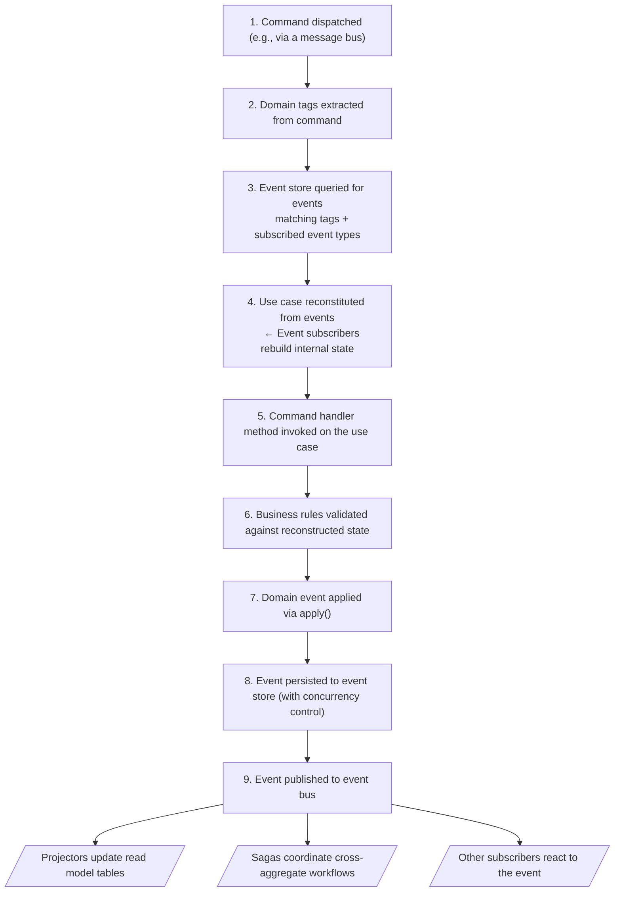
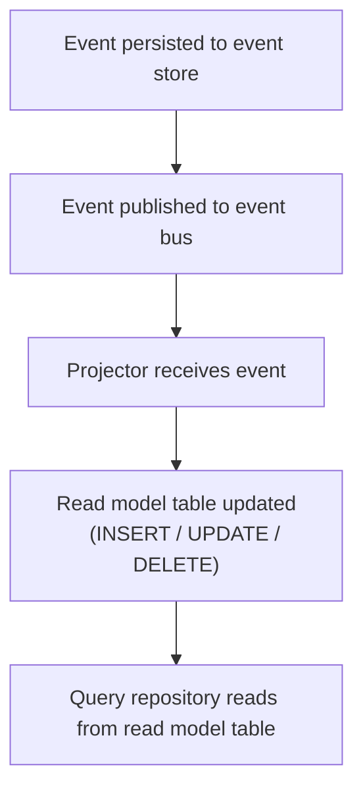

## How it works

This section explains how the core concepts of _Gember Event Sourcing_ fit together, from command dispatch to event persistence and read model updates.

### End-to-end flow

When a command is dispatched, the following process occurs:


```mermaid
flowchart TD
    A["1. Command dispatched (e.g., via a message bus)"]
    B["2. Domain tags extracted from command"]
    C["3. Event store queried for events
    matching tags + subscribed event types"]
    D["4. Use case reconstituted from events
    ← Event subscribers rebuild internal state"]
    E["5. Command handler method invoked on the use case"]
    F["6. Business rules validated against reconstructed state"]
    G["7. Domain event applied via apply()"]
    H["8. Event persisted to event store (with concurrency control)"]
    I["9. Event published to event bus"]
    J[/"Projectors update read model tables"/]
    K[/"Sagas coordinate cross-aggregate workflows"/]
    L[/"Other subscribers react to the event"/]

    A --> B --> C --> D --> E --> F --> G --> H --> I
    I --> J
    I --> K
    I --> L
```

### Event store

Events are persisted in two storage structures:

**Event store** - The primary event log:

| Field | Description |
|-------|-------------|
| `id` | Unique event ID |
| `event_name` | Event type (e.g., `course.created`) |
| `payload` | Serialized event data (typically JSON) |
| `metadata` | Additional context (e.g., user, correlation ID) |
| `applied_at` | Timestamp when the event was applied |

**Event store relations** - Links events to domain tags for efficient retrieval:

| Field | Description |
|-------|-------------|
| `event_id` | Reference to the event |
| `domain_tag` | A domain tag value from the event |

**Event store lock** - Serializes concurrent writes per consistency boundary:

| Field | Description |
|-------|-------------|
| `boundary_hash` | SHA-256 hash of the domain tags + event types |

When an event is persisted, a relation row is created for each `#[DomainTag]` property on the event. This allows the event store to efficiently query events when loading a use case. The query is scoped by both the domain tags (from the command) and the subscribed event types (from the use case's `#[DomainEventSubscriber]` methods), so only relevant events are loaded.

### Domain tags across components

Domain tags appear on commands, use cases, and events, each serving a different purpose:

| Component | Domain tag purpose | Example |
|-----------|-------------------|---------|
| **Command** | Which events to **load** from the event store | _"Load subscribed events tagged with this practitionerId"_ |
| **Use case** | **Consistency boundary** scope (must match command) | _"Ensure no concurrent changes to subscribed events for this practitioner"_ |
| **Event** | How to **index** the event for future retrieval | _"Index this event under both timeslotId and practitionerId"_ |

The command and use case tags must match exactly. The event tags are independent and determined by which use cases will need to load the event in the future.

### Concurrency control

_Gember Event Sourcing_ uses a two-layer concurrency strategy to ensure consistency without unnecessary contention.

#### Consistency boundaries

The domain tags and subscribed event types of a use case together define its **consistency boundary** — the set of events it depends on. This boundary determines the lock scope:

- **Broader tags** (e.g., `practitionerId`) widen the scope across more events
- **Narrower tags** (e.g., `timeslotId`) limit the scope to fewer events
- **Subscribed event types** further narrow the scope — two use cases with the same domain tags but different subscribed event types will not conflict with each other

Using the DCB pattern, unrelated changes can proceed concurrently. For example, renaming a course and enrolling a student happen through different use cases with different subscribed event types and domain tags, so they never conflict.

#### How writes are serialized

When a use case is saved, the event store performs the following steps atomically within a single database transaction:

1. **Acquire a boundary lock** — A dedicated lock table holds one row per consistency boundary (identified by a deterministic hash of the domain tags and event types). The row is created if it doesn't exist yet, then locked with `SELECT ... FOR UPDATE`. This ensures concurrent writers targeting the same boundary are serialized — one blocks until the other commits.

2. **Check the optimistic lock** — With the boundary lock held, the event store queries the last persisted event ID for this boundary and compares it to the `lastEventId` the caller saw when loading. If they don't match, another writer committed events in between and an `OptimisticLockException` is thrown.

3. **Persist events** — If the check passes, the new events are inserted within the same transaction.

4. **Commit** — The transaction commits, releasing the boundary lock.

```
Writer A                                Writer B
────────                                ────────
BEGIN TRANSACTION                       BEGIN TRANSACTION
Acquire boundary lock ✓                 Acquire boundary lock → blocks...
Check lastEventId ✓                         │
Insert events                               │
COMMIT (releases lock)                      │
                                        ...resumes
                                        Check lastEventId → mismatch!
                                        ROLLBACK + OptimisticLockException
```

This two-layer approach avoids the classic time-of-check-time-of-use (TOCTOU) race condition that would occur if the lock check and the write were separate operations.

#### Saga concurrency

The saga store uses the same boundary lock mechanism. When a saga is saved, the store acquires an exclusive lock on the saga's boundary (based on saga name and saga IDs), then performs the get-modify-save cycle within a single transaction. This prevents concurrent events for the same saga from overwriting each other's state changes.

### CQRS and the read side

_Gember Event Sourcing_ implements the write side of CQRS (Command Query Responsibility Segregation). The read side is typically built using **projections** (also called read models or projectors).

#### Write side (event store)

The event store is the single source of truth. State is reconstructed by replaying events through use case event subscribers. This provides strong consistency through boundary locking and optimistic lock checks.

#### Read side (projections)

After events are persisted, they are published to an event bus. **Projectors** subscribe to these events and maintain denormalized read model tables optimized for queries:


```mermaid
flowchart TD
    A["Event persisted to event store"] --> B["Event published to event bus"]
    B --> C["Projector receives event"]
    C --> D["Read model table updated
    (INSERT / UPDATE / DELETE)"]
    D --> E["Query repository reads from read model table"]
```

Projectors are not part of the _Gember Event Sourcing_ library itself - they are built using your framework's messaging capabilities (e.g., Symfony Messenger). The library handles event persistence and publishing; your application handles projecting events into read models.

#### Consistency model

| Side | Consistency | Description |
|------|-------------|-------------|
| Write (event store) | Strong | Atomic writes with boundary locking per stream query (domain tags + subscribed event types) |
| Read (projections) | Eventual | Updated after events are persisted and published |

With synchronous event transport, read models are updated immediately after the write completes. Asynchronous transport introduces a delay but improves throughput.

> **Note:** By default, events are dispatched synchronously after persistence. If the process crashes between persisting and dispatching, events can be lost. The [Outbox](/docs/usage/outbox.md) pattern solves this by writing events to an outbox table atomically with the event store, then dispatching them via a background processor with at-least-once delivery guarantees.

### Saga store

Sagas are persisted directly (not event-sourced) in a saga store with three structures:

| Structure | Purpose |
|-----------|---------|
| Saga store | Stores serialized saga instances (ID, name, payload, timestamps) |
| Saga store relations | Links Saga ID values to saga instances for routing |
| Saga store lock | Serializes concurrent writes per saga boundary (same mechanism as the event store) |

When a domain event is published, the saga framework extracts `#[SagaId]` values from the event and uses the saga store relations to find the correct saga instance to invoke.
