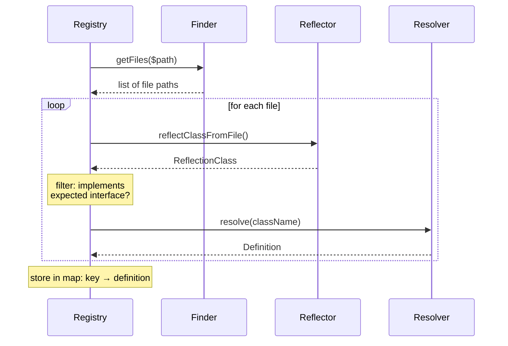
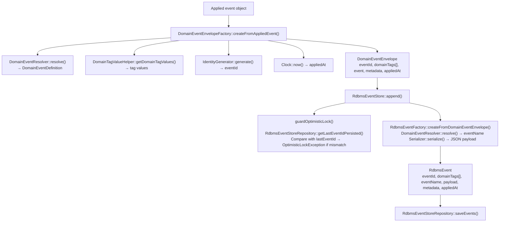
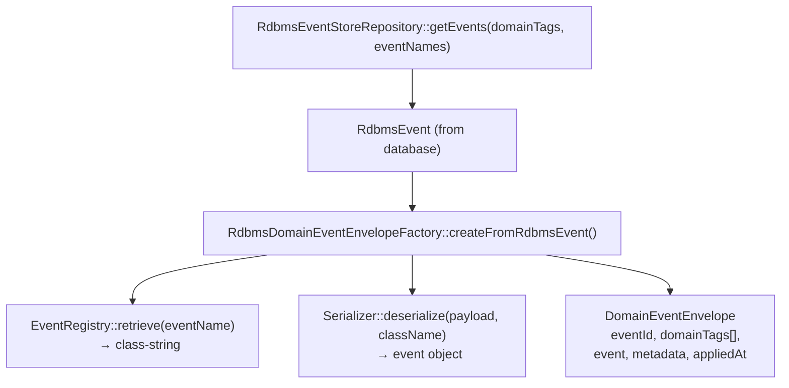
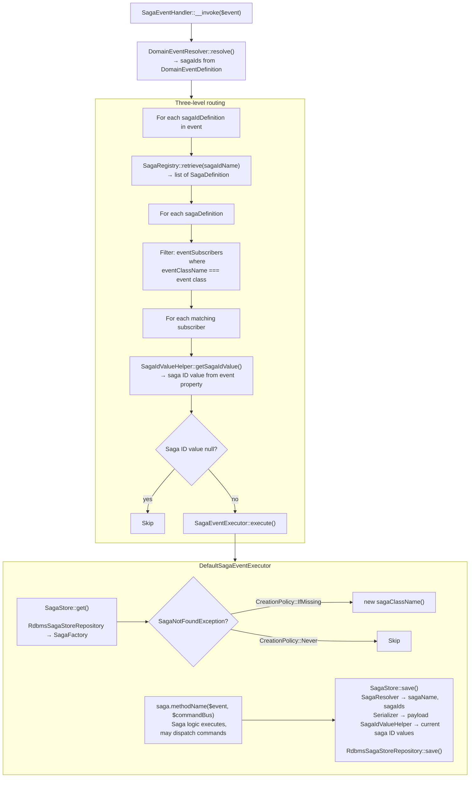

## Library architecture

This document explains the internal code organization of _Gember Event Sourcing_. It is intended for developers who want to understand, extend, or contribute to the library.

For the conceptual end-to-end flow from a user's perspective, see [How it works](/docs/how-it-works.md). For usage instructions, see [Usage](/docs/usage.md).

### Source directory overview

```
src/
├── Common/           Shared enums and value types
├── EventStore/       Event persistence abstraction and RDBMS implementation
├── Registry/         Runtime class-discovery registries
├── Repository/       Use case and saga persistence
├── Resolver/         Attribute-based metadata extraction (reflection)
├── Saga/             Saga event handling entry point and execution
├── UseCase/          Use case interface, traits, and command handling entry point
└── Util/             Low-level utilities (file, serialization, string, time)
```

| Directory | Responsibility | Key interfaces | Key implementations |
|-----------|---------------|----------------|---------------------|
| `Common/` | Shared types used across the library | — | `CreationPolicy` enum |
| `EventStore/` | Persist and load domain events | `EventStore` | `RdbmsEventStore`, `LoggableEventStoreDecorator` |
| `Registry/` | Map commands, events, and sagas to their definitions at runtime | `CommandHandlerRegistry`, `EventRegistry`, `SagaRegistry` | `Reflector*Registry`, `Cached*RegistryDecorator` |
| `Repository/` | Load and save use cases and sagas | `UseCaseRepository`, `SagaStore` | `EventSourcedUseCaseRepository`, `RdbmsSagaStore` |
| `Resolver/` | Extract metadata from PHP attributes via reflection | `UseCaseResolver`, `DomainEventResolver`, `DomainCommandResolver`, `SagaResolver` | `Default*Resolver`, `Cached*ResolverDecorator` |
| `Saga/` | Route domain events to saga instances and execute saga methods | `SagaEventExecutor` | `SagaEventHandler`, `DefaultSagaEventExecutor` |
| `UseCase/` | Define use case contracts and handle commands | `EventSourcedUseCase`, `UseCaseCommandExecutor` | `EventSourcedUseCaseBehaviorTrait`, `UseCaseCommandHandler` |
| `Util/` | File scanning, serialization, time, string helpers | `Finder`, `Reflector`, `Clock`, `Serializable` | `NativeFinder`, `NativeReflector`, `NativeClock`, `StackedSerializer` |

### Design patterns

Four recurring patterns appear throughout the library.

#### Interface-first design

Every component is defined by an interface. Implementations live in subdirectories named by strategy. This layout is consistent across the entire codebase:

```
SomeComponent/
├── SomeInterface.php
├── Default/
│   └── DefaultSomeImplementation.php
├── Loggable/
│   └── LoggableSomeDecorator.php
└── Cached/
    └── CachedSomeDecorator.php
```

Directory naming conventions:

| Directory | Purpose |
|-----------|---------|
| `Default/` | Primary implementation |
| `Attribute/` | Reads PHP attributes via reflection |
| `Interface/` | Reads from a PHP interface method |
| `Stacked/` | Chain-of-responsibility (tries multiple strategies) |
| `Reflector/` | Uses filesystem scanning + reflection |
| `Rdbms/` | Database-backed implementation |
| `Cached/` | PSR-16 cache decorator |
| `Loggable/` | PSR-3 logging decorator |
| `Native/` | PHP-native utility implementation |

#### Stacked resolvers

When multiple resolution strategies exist (e.g., attribute-based, interface-based, class-name fallback), a "stacked" implementation tries each strategy in order and returns the first successful result:

```php
foreach ($this->resolvers as $resolver) {
    try {
        return $resolver->resolve($className);
    } catch (UnresolvableException) {
        continue;
    }
}
```

This pattern appears in `StackedDomainTagResolver`, `StackedEventNameResolver`, `StackedSagaNameResolver`, and `StackedSerializer`.

#### Decorator pattern

Both logging and caching are implemented as decorators — they wrap an inner instance of the same interface:

```
Interface
├── DefaultImplementation
├── LoggableDecorator(Interface, LoggerInterface)     ← PSR-3
└── CachedDecorator(Interface, CacheInterface)        ← PSR-16
```

Logging decorators add timing and context to operations. Caching decorators serialize Definition DTOs to JSON and store them in a PSR-16 cache, avoiding repeated reflection.

#### Definition DTOs

All resolver outputs are `readonly` Definition classes that implement the library's `Serializable` interface:

```php
/**
 * @template TPayload of array
 * @template TSerializable of self
 */
interface Serializable
{
    /** @return TPayload */
    public function toPayload(): array;

    /** @param TPayload $payload */
    public static function fromPayload(array $payload): static;
}
```

This enables JSON-based caching: the cached decorator calls `toPayload()` before storing and `fromPayload()` after retrieval.

Definition types used across the library:

| Definition | Produced by | Contains |
|------------|-------------|----------|
| `UseCaseDefinition` | `UseCaseResolver` | className, domainTags, commandHandlers, eventSubscribers |
| `CommandHandlerDefinition` | `CommandHandlerResolver` | commandClassName, methodName, policy |
| `EventSubscriberDefinition` | `EventSubscriberResolver` | eventClassName, methodName |
| `DomainCommandDefinition` | `DomainCommandResolver` | commandClassName, domainTags |
| `DomainEventDefinition` | `DomainEventResolver` | eventClassName, eventName, domainTags, sagaIds |
| `DomainTagDefinition` | `DomainTagResolver` | domainTagName, type (Property or Method) |
| `SagaDefinition` | `SagaResolver` | sagaClassName, sagaName, sagaIds, eventSubscribers |
| `SagaEventSubscriberDefinition` | `SagaEventSubscriberResolver` | eventClassName, methodName, policy |
| `SagaIdDefinition` | `SagaIdResolver` | sagaIdName, propertyName |

### Resolver layer

The resolver layer is the largest part of the library. It uses PHP reflection to read attributes from user classes and produces Definition DTOs that describe the metadata the library needs at runtime.

#### How resolving works

Each top-level resolver takes a class name and returns a Definition DTO:

| Resolver | Input | Output | Sub-resolvers |
|----------|-------|--------|---------------|
| `UseCaseResolver` | Use case class | `UseCaseDefinition` | DomainTagResolver, CommandHandlerResolver, EventSubscriberResolver |
| `DomainCommandResolver` | Command class | `DomainCommandDefinition` | DomainTagResolver |
| `DomainEventResolver` | Event class | `DomainEventDefinition` | EventNameResolver, DomainTagResolver, SagaIdResolver |
| `SagaResolver` | Saga class | `SagaDefinition` | SagaNameResolver, SagaIdResolver, SagaEventSubscriberResolver |

Sub-resolvers use `AttributeResolver` (a utility in `Util/Attribute/`) to scan PHP classes for specific attributes:

```
AttributeResolver
├── getPropertiesWithAttribute(className, attributeClass)    → #[DomainTag], #[SagaId]
├── getMethodsWithAttribute(className, attributeClass)       → #[DomainEventSubscriber], #[DomainCommandHandler]
└── getAttributesForClass(className, attributeClass)         → #[DomainEvent], #[Saga]
```

#### Stacked resolution chains

Some sub-resolvers support multiple strategies. The stacked resolver tries each in order:

**Event name resolution** (`StackedEventNameResolver`):
1. `AttributeEventNameResolver` — reads `#[DomainEvent(name: '...')]`
2. `InterfaceEventNameResolver` — calls `NamedDomainEvent::getName()`
3. `ClassNameEventNameResolver` — derives name from FQCN (fallback)

**Domain tag resolution** (`StackedDomainTagResolver`):
1. `AttributeDomainTagResolver` — reads `#[DomainTag]` properties
2. `InterfaceDomainTagResolver` — calls `SpecifiedDomainTags::getDomainTags()`

**Saga name resolution** (`StackedSagaNameResolver`):
1. `AttributeSagaNameResolver` — reads `#[Saga(name: '...')]`
2. `InterfaceSagaNameResolver` — calls `NamedSaga::getName()`
3. `ClassNameSagaNameResolver` — derives name from FQCN (fallback)

#### Domain tag value extraction

At runtime, `DomainTagValueHelper` extracts actual tag values from objects using their `DomainTagDefinition`:

- **`DomainTagType::Property`** — reads the property value directly (e.g., `$command->courseId`)
- **`DomainTagType::Method`** — calls a method that returns a list of values (e.g., `$event->getDomainTags()`)

The same helper is used for commands, use cases, and events.

#### Caching

Each top-level resolver has a `Cached*ResolverDecorator` that wraps the real resolver:

1. Build a cache key: `gember.resolver.{type}.{friendly-class-name}`
2. On cache hit: deserialize JSON via `Definition::fromPayload()`
3. On cache miss: resolve, serialize via `Definition::toPayload()`, store as JSON

All caching uses the PSR-16 `CacheInterface`.

### Registry layer

Registries are runtime lookup tables that map commands, events, and sagas to their resolved definitions. They are built lazily on first access by scanning the filesystem.

#### Discovery process



The `Finder` scans a given directory for PHP files. The `Reflector` creates `ReflectionClass` instances from those files. The registry then filters for relevant classes and resolves their definitions.

#### Registries

| Registry | Lookup key | Returns | Scans for |
|----------|-----------|---------|-----------|
| `CommandHandlerRegistry` | Command FQCN | `[useCaseClassName, CommandHandlerDefinition]` | Classes implementing `EventSourcedUseCase` |
| `EventRegistry` | Event name (e.g., `course.created`) | Event FQCN | Domain event classes |
| `SagaRegistry` | Saga ID name (e.g., `orderId`) | `list<SagaDefinition>` | Saga classes with event subscribers |

Each registry has a `Cached*RegistryDecorator` that stores the resolved lookup table in PSR-16 cache.

**Note:** `SagaRegistry` can return multiple saga definitions for a single saga ID name, because multiple sagas can react to the same identifier.

### Internal command handling flow

When `UseCaseCommandHandler::__invoke()` is called with a command object, the following sequence occurs:

```mermaid
flowchart TD
    invoke["UseCaseCommandHandler::__invoke($command)"]

    invoke --> registry["CommandHandlerRegistry::retrieve()
    → useCaseClassName + CommandHandlerDefinition"]
    invoke --> resolve["DomainCommandResolver::resolve()
    → DomainCommandDefinition"]
    invoke --> extract["DomainTagValueHelper::getDomainTagValues()
    → actual tag values from command"]
    invoke --> execute["UseCaseCommandExecutor::execute()"]

    subgraph loading ["Loading use case"]
        get["UseCaseRepository::get()"]
        ucResolve["UseCaseResolver::resolve()
        → get eventSubscribers"]
        load["EventStore::load(StreamQuery)
        events matching tags + subscribed types"]
        reconstitute["reconstitute() via
        EventSourcedUseCaseBehaviorTrait
        route envelopes to subscriber methods"]
        get --> ucResolve --> load --> reconstitute
    end

    execute --> loading

    missing{"UseCaseNotFoundException?"}
    execute --> missing
    missing -->|"CreationPolicy::IfMissing"| create["new useCaseClassName()"]

    subgraph handling ["Executing business logic"]
        handle["useCase.methodName($command)"]
        apply["apply($event)
        → queues in appliedEvents
        → calls subscriber immediately"]
        handle --> apply
    end

    execute --> handling

    subgraph saving ["Saving use case"]
        save["UseCaseRepository::save()"]
        envelope["DomainEventEnvelopeFactory
        for each applied event:
        DomainEventResolver, DomainTagValueHelper,
        IdentityGenerator, Clock"]
        append["EventStore::append()"]
        lock["guardOptimisticLock()
        compare lastEventId with persisted"]
        persist["RdbmsEventStoreRepository::saveEvents()"]
        publish["EventBus::handle()
        for each applied event"]
        save --> envelope --> append --> lock --> persist --> publish
    end

    execute --> saving
```



**UseCaseAttributeRegistry**: A static registry that holds a `UseCaseResolver` reference. It exists because `EventSourcedUseCaseBehaviorTrait` needs to resolve domain tag definitions at runtime, but use cases are instantiated via `new self()` (no constructor injection). The registry is initialized once during application bootstrap.

### Internal event persistence flow

#### Write path



#### Read path



The `EventRegistry` is used during the read path to map stored event names (e.g., `course.created`) back to PHP class names (e.g., `App\Domain\Course\CourseCreatedEvent`).

### Internal saga handling flow

When a domain event is published to the event bus, `SagaEventHandler` routes it to the correct saga instances:



The routing uses a three-level nested lookup: event saga IDs → saga registry (by saga ID name) → event subscriber filter (by event class). This allows a single event to trigger multiple sagas through different saga IDs, and a single saga to respond to events with different identifiers.

### Dependency boundary

The library defines its internal interfaces and depends on external contracts for infrastructure concerns.

#### External contracts (gember/dependency-contracts)

These interfaces must be implemented by a framework integration package (e.g., [gember/event-sourcing-symfony-bundle](https://github.com/GemberPHP/event-sourcing-symfony-bundle)):

| Contract | Purpose | Used by |
|----------|---------|---------|
| `RdbmsEventStoreRepository` | Database persistence for events | `RdbmsEventStore` |
| `RdbmsSagaStoreRepository` | Database persistence for sagas | `RdbmsSagaStore` |
| `Serializer` | Object serialization/deserialization | `RdbmsEventFactory`, `RdbmsDomainEventEnvelopeFactory`, `RdbmsSagaStore`, `SagaFactory` |
| `CommandBus` | Dispatch commands from sagas | `DefaultSagaEventExecutor` |
| `EventBus` | Publish domain events after persistence | `EventSourcedUseCaseRepository` |
| `IdentityGenerator` | Generate unique event IDs | `DomainEventEnvelopeFactory` |

#### PSR interfaces

| Interface | Standard | Used by |
|-----------|----------|---------|
| `LoggerInterface` | PSR-3 (`psr/log`) | `LoggableEventStoreDecorator`, `LoggableUseCaseCommandExecutorDecorator`, `LoggableSagaEventExecutorDecorator` |
| `CacheInterface` | PSR-16 (`psr/simple-cache`) | All `Cached*Decorator` classes |

#### Internal interfaces

All other interfaces are defined and implemented within this library: `EventStore`, `UseCaseRepository`, `SagaStore`, `UseCaseCommandExecutor`, `SagaEventExecutor`, all resolvers, all registries, `Finder`, `Reflector`, `Clock`, `AttributeResolver`, and `FriendlyClassNamer`.

### Extending the library

#### Adding a new resolver strategy

Implement the relevant resolver interface (e.g., `DomainTagResolver`), then add it to the corresponding `Stacked*` resolver's iterable. For example, a YAML-based domain tag resolver could be added alongside the attribute and interface resolvers in `StackedDomainTagResolver`.

#### Adding a new persistence backend

Two options:

1. **Implement the external contracts** — Create a new package implementing `RdbmsEventStoreRepository` and `RdbmsSagaStoreRepository` for your database (e.g., MongoDB, DynamoDB). The existing `RdbmsEventStore` and `RdbmsSagaStore` will use them.

2. **Implement the internal interfaces** — Create new implementations of `EventStore` and `SagaStore` directly, bypassing the RDBMS layer entirely. This gives full control over the persistence strategy.

#### Adding cross-cutting concerns

Use the decorator pattern. Implement the same interface, wrap the inner instance, and add behavior. For example, a metrics decorator for `EventStore`:

```php
final readonly class MetricsEventStoreDecorator implements EventStore
{
    public function __construct(
        private EventStore $inner,
        private MetricsCollector $metrics,
    ) {}

    public function load(StreamQuery $streamQuery): array
    {
        $this->metrics->increment('event_store.load');
        return $this->inner->load($streamQuery);
    }

    // ...
}
```

#### Adding a new attribute

1. Define the attribute class in the relevant `Attribute/` directory
2. Create a resolver that reads it via `AttributeResolver`
3. Wire it into the resolution chain (add to the relevant `Default*Resolver` or `Stacked*` resolver)
4. Define a Definition DTO implementing `Serializable` if the result needs caching
